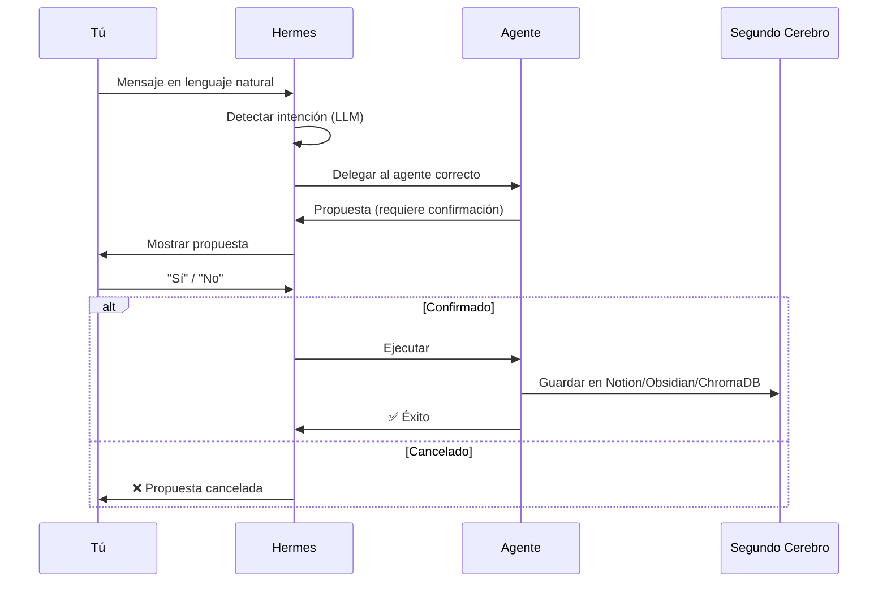
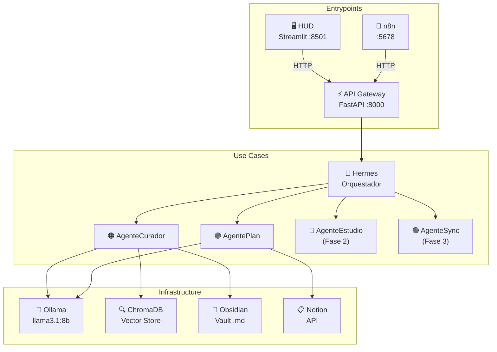

# 📖 Manual de Usuario — Agent IA

> **Versión:** 0.1.0 · **Autor:** Miguel Ángel Polo Castro · **Repo:** [Agent-IA](https://github.com/m1guel132/Agent-IA)

---

## 1. ¿Qué es Agent IA?

Agent IA es un **copiloto personal de gestión de conocimiento y estudio**, construido con arquitectura hexagonal. El sistema orquesta **agentes especializados** mediante LLMs locales (Ollama) para automatizar el mantenimiento de tu **Segundo Cerebro** (Notion + Obsidian).

Toda la interacción se realiza a través de **lenguaje natural** en un chat con **Hermes**, el orquestador central.

### Componentes principales

| Componente | Puerto | Descripción |
|---|---|---|
| **API Gateway** (FastAPI) | `:8000` | Cerebro del sistema. Recibe mensajes, orquesta agentes, conecta con Notion/Obsidian/ChromaDB. |
| **HUD** (Streamlit) | `:8501` | Interfaz visual web. Chat con Hermes, panel de agentes y estado del sistema. |
| **Ollama** | `:11434` | LLM local (`llama3.1:8b`) y embeddings (`nomic-embed-text`). |
| **n8n** | `:5678` | Flujos automáticos de sincronización e inbox (proactividad). |

---

## 2. Prerrequisitos

Antes de usar Agent IA necesitas tener instalado:

- **Python 3.14+** (vía Microsoft Store o `py` launcher)
- **uv** — gestor de dependencias ultrarrápido ([instalar](https://docs.astral.sh/uv/getting-started/installation/))
- **Ollama** con los modelos:
  - `llama3.1:8b` (razonamiento)
  - `nomic-embed-text` (embeddings para ChromaDB)
- **n8n** — instalado de forma nativa para los flujos automáticos
- **Docker** (opcional, para infraestructura externa)

---

## 3. Instalación y Configuración

### 3.1 Instalar dependencias

```bash
# Desde la carpeta del proyecto
uv sync
```

### 3.2 Configurar variables de entorno

Renombra `.env.example` a `.env` y completa tus credenciales:

```properties
# --- Notion ---
AGENT_NOTION_TOKEN=tu_token_aqui
AGENT_NOTION_ROOT_PAGE_ID=id_de_tu_pagina_raiz

# --- Ollama (LLM local) ---
AGENT_OLLAMA_BASE_URL=http://localhost:11434
AGENT_OLLAMA_MODEL=llama3.1:8b
AGENT_OLLAMA_EMBED_MODEL=nomic-embed-text

# --- Obsidian Vault ---
AGENT_OBSIDIAN_VAULT_PATH=C:\Users\migue\Agent_IA_Vault

# --- ChromaDB ---
AGENT_CHROMA_PERSIST_DIR=./data/chroma

# --- n8n ---
AGENT_N8N_BASE_URL=http://localhost:5678

# --- API Gateway ---
AGENT_API_HOST=0.0.0.0
AGENT_API_PORT=8000

# --- HUD Streamlit ---
AGENT_HUD_PORT=8501
```

> [!IMPORTANT]
> Las variables de Telegram, Google Calendar, Todoist, Canvas y Gemini están comentadas en `.env.example` porque corresponden a fases futuras. No necesitas configurarlas ahora.

### 3.3 Descargar modelos de Ollama

```bash
ollama pull llama3.1:8b
ollama pull nomic-embed-text
```

---

## 4. Levantar el Sistema

El sistema requiere **dos procesos** ejecutándose simultáneamente. Abre dos terminales en la carpeta del proyecto:

### Terminal 1 — API Gateway (el cerebro)

```bash
uv run agent-api
```

Esto levanta la API de FastAPI en `http://localhost:8000`.

### Terminal 2 — HUD (la interfaz visual)

```bash
uv run agent-hud
```

Esto abre automáticamente tu navegador en `http://localhost:8501`.

> [!TIP]
> Verifica que el indicador en la esquina superior derecha del HUD muestre 🟢 **Activo**. Si aparece 🔴, la API no está corriendo.

---

## 5. Interfaz del HUD

El HUD tiene un diseño de dos columnas:

### Columna izquierda — Chat con Hermes

Es el punto de interacción principal. Escribes mensajes en lenguaje natural y Hermes decide qué agente debe actuar.

### Columna derecha — Panel informativo

| Sección | Contenido |
|---|---|
| 🤖 **Agentes** | Lista de los 4 agentes registrados con indicador de color |
| ⚙️ **Sistema** | Versión del sistema y estado de conexión |
| 📚 **Próximo repaso** | Stub de AgenteEstudio (Fase 2) |

Cada respuesta del asistente muestra una etiqueta indicando **qué agente** la generó (ej. `🤖 AgenteCurador`). También puedes expandir el JSON crudo de la respuesta para depuración.

---

## 6. Los Agentes

Hermes es el **orquestador central** que analiza cada mensaje y delega al agente correcto. Hay 4 agentes especializados:

### 6.1 🟠 AgenteCurador — Segundo Cerebro

**Estado:** ✅ Implementado (Fase 1)
**Dominio:** Notas, Áreas, Tags, Inbox

El AgenteCurador gestiona tu base de conocimiento. Opera en **modo revisión**: propone cambios y espera tu confirmación antes de aplicarlos.

#### Crear una nota

Simplemente dile a Hermes qué quieres anotar:

> **Tú:** *"Anota esto: terminé de configurar el firewall del laboratorio de Redes."*

El AgenteCurador usará el LLM para detectar automáticamente el área y los tags, y te mostrará una propuesta:

> **Hermes:** *"📋 Propuesta de nota (ID: `a3b9f1`)*
> *Área sugerida: `Redes`*
> *Tags: laboratorio, firewall*
> *¿Confirmas esta categorización?"*

Si existen notas similares, **ChromaDB** buscará coincidencias semánticas y te avisará de posibles duplicados (similitud > 85%).

#### Confirmar una propuesta

Responde afirmativamente:

> **Tú:** *"Sí"*, *"confirmo"*, *"ok"*, *"dale"*, *"yes"*, o *"correcto"*

Al confirmar, la nota se guarda **bidireccionalmente** en:
1. **Obsidian** — como archivo `.md` en tu vault, organizado por área
2. **ChromaDB** — indexada para búsqueda semántica futura

#### Cancelar una propuesta

Responde negativamente:

> **Tú:** *"No"*, *"cancelar"*, *"ajustar"*, *"cambiar"*, o *"nope"*

#### Organizar el Inbox

Si tienes notas acumuladas en la carpeta `inbox/` de tu vault de Obsidian:

> **Tú:** *"Organiza mi inbox"*

Agent IA escaneará la carpeta y te propondrá qué hacer con los archivos sin área asignada.

#### Buscar en tu conocimiento

Puedes buscar notas por similitud semántica:

> **Tú:** *"Busca todo lo relacionado con redes"*

El sistema consultará ChromaDB y te devolverá los 5 resultados más relevantes con su porcentaje de relevancia.

---

### 6.2 🟣 AgentePlan — Estratega y Planificador

**Estado:** ✅ Implementado (Fase 1)
**Dominio:** Tareas, Proyectos, Objetivos

El AgentePlan tiene dos modos de operación:

#### Modo rápido — Crear una tarea

Para tareas simples, usa comandos directos (sin pasar por el LLM):

> **Tú:** *"Agrega una tarea: entregar proyecto de redes"*
> **Tú:** *"Tarea: estudiar para el examen de cálculo"*
> **Tú:** *"Recuérdame que envíe el reporte"*

La tarea se crea **inmediatamente** en tu base de datos de Notion.

#### Modo estratégico — Planificación con LLM

Para metas complejas, el AgentePlan usa el LLM para desglosar tu objetivo en un plan estructurado:

> **Tú:** *"Quiero aprobar Física Electromagnética este semestre"*

El agente generará un plan completo:

> **Hermes:**
> *💡 Propuesta de Plan Estratégico:*
>
> *🎯 Objetivo: Aprobar Física Electromagnética (Área: Universidad)*
>
> *📁 Proyecto: Dominar las leyes de Maxwell*
> *  - [ ] Repasar ley de Gauss*
> *  - [ ] Resolver ejercicios de ley de Faraday*
> *  - [ ] Practicar con problemas de ondas electromagnéticas*
>
> *¿Quieres que implemente este plan en tu Segundo Cerebro?*

Al confirmar, el sistema crea en Notion:
1. Un **Objetivo** (relacionado con el Área)
2. Uno o varios **Proyectos** (relacionados con el Objetivo)
3. **Tareas accionables** dentro de cada proyecto

---

### 6.3 🔵 AgenteEstudio — Study Board

**Estado:** 🔜 Stub (Fase 2)

Próximamente incluirá:
- Repetición espaciada con algoritmo **SM-2**
- Tarjetas de repaso generadas automáticamente desde tus notas
- Plantillas **Cornell** para toma de notas
- Notificaciones de repasos pendientes

---

### 6.4 🟢 AgenteSync — Sincronización

**Estado:** 🔜 Stub (Fase 3)

Próximamente incluirá:
- Sincronización bidireccional **Notion ↔ Obsidian**
- Integración con **Todoist** para tareas
- Integración con **Google Calendar** para eventos

---

## 7. Flujo de Confirmación

> [!NOTE]
> Agent IA sigue la regla de oro: **"Propone, no aplica solo"** (RF5.4). Ningún agente modifica tu Segundo Cerebro sin tu confirmación explícita.

El flujo funcional es:



---

## 8. Flujos Automáticos con n8n

Agent IA no solo es reactivo, también es **proactivo** gracias a n8n. Los flujos hacen peticiones HTTP a `http://localhost:8000/chat` para despertar a Agent IA automáticamente.

### 8.1 Importar los flujos

1. Abre tu interfaz local de n8n → `http://localhost:5678`
2. Ve a *Workflows* → *Import from File*
3. Selecciona los archivos de la carpeta [`n8n/`](file:///c:/Users/migue/Desktop/Agent%20IA/n8n):
   - `sync_periodica.json` — Sincronización periódica
   - `clasificador_inbox.json` — Clasificación automática del inbox
4. Actívalos

> [!TIP]
> El flujo de sincronización puede ejecutarse cada 4 horas para revisar automáticamente tu inbox sin que tú hagas nada.

---

## 9. Arquitectura del Sistema



### Patrón de Arquitectura Hexagonal

| Capa | Carpeta | Responsabilidad |
|---|---|---|
| **Dominio** | `domain/entities/` | Entidades: `Nota`, `Area`, `Tarea`, `ItemEstudio`, `Habito` |
| **Dominio** | `domain/ports/` | Interfaces (puertos): `LLMPort`, `NotionPort`, `ObsidianPort`, `VectorStorePort` |
| **Casos de Uso** | `use_cases/` | Lógica de negocio: `Hermes`, `AgenteCurador`, `AgentePlan`, etc. |
| **Infraestructura** | `infrastructure/` | Adaptadores: `OllamaAdapter`, `NotionAdapter`, `ObsidianAdapter`, `ChromaAdapter` |
| **Entrypoints** | `entrypoints/api/` | API REST (FastAPI) + inyección de dependencias |
| **Entrypoints** | `entrypoints/hud/` | Interfaz web (Streamlit) |

---

## 10. Endpoints de la API

| Método | Endpoint | Descripción |
|---|---|---|
| `GET` | `/` | Info del sistema (versión, modelo, etc.) |
| `GET` | `/health` | Estado de salud + agentes registrados |
| `POST` | `/chat/` | Enviar un mensaje a Hermes. Body: `{"mensaje": "tu texto"}` |

---

## 11. Variables de Entorno

Todas las variables usan el prefijo `AGENT_` para evitar colisiones:

| Variable | Requerida | Descripción |
|---|---|---|
| `AGENT_NOTION_TOKEN` | ✅ | Token de integración de Notion |
| `AGENT_NOTION_ROOT_PAGE_ID` | ✅ | ID de tu página raíz en Notion |
| `AGENT_OLLAMA_BASE_URL` | — | URL de Ollama (default: `http://localhost:11434`) |
| `AGENT_OLLAMA_MODEL` | — | Modelo de razonamiento (default: `llama3.1:8b`) |
| `AGENT_OLLAMA_EMBED_MODEL` | — | Modelo de embeddings (default: `nomic-embed-text`) |
| `AGENT_OBSIDIAN_VAULT_PATH` | ✅ | Ruta absoluta a tu vault de Obsidian |
| `AGENT_CHROMA_PERSIST_DIR` | — | Directorio de persistencia de ChromaDB (default: `./data/chroma`) |
| `AGENT_N8N_BASE_URL` | — | URL de n8n (default: `http://localhost:5678`) |
| `AGENT_API_HOST` | — | Host de la API (default: `0.0.0.0`) |
| `AGENT_API_PORT` | — | Puerto de la API (default: `8000`) |
| `AGENT_HUD_PORT` | — | Puerto del HUD (default: `8501`) |

---

## 12. Tests

Para verificar que todo funciona a nivel interno:

```bash
uv run pytest
```

Esto ejecuta los tests unitarios que validan:
- Lógica de dominio y entidades
- Modelo matemático SM-2 (repetición espaciada)
- Enrutamiento y delegación de agentes

---

## 13. Roadmap de Fases

| Fase | Agente | Funcionalidad | Estado |
|---|---|---|---|
| **1** | AgenteCurador | Curaduría de notas, clasificación, búsqueda semántica | ✅ Implementado |
| **1** | AgentePlan | Tareas rápidas + planificación estratégica en Notion | ✅ Implementado |
| **2** | AgenteEstudio | Repetición espaciada SM-2, tarjetas, Cornell | 🔜 Pendiente |
| **3** | AgenteSync | Sincronización Notion↔Obsidian, Todoist, Google Calendar | 🔜 Pendiente |
| **4** | — | Bot de Telegram como entrypoint adicional | 🔜 Pendiente |
| **5** | — | Integración con Canvas LMS | 🔜 Pendiente |

---

## 14. Tolerancia a Fallos

> [!NOTE]
> Si un agente falla, **no bloquea al resto del sistema** (RF5.2). Hermes captura el error, lo registra, y te notifica que el agente tuvo un problema mientras el resto sigue operativo.

Ejemplo de mensaje de error aislado:

> *⚠️ AgenteCurador encontró un error: Connection timeout.*
> *El resto del sistema sigue operativo.*
